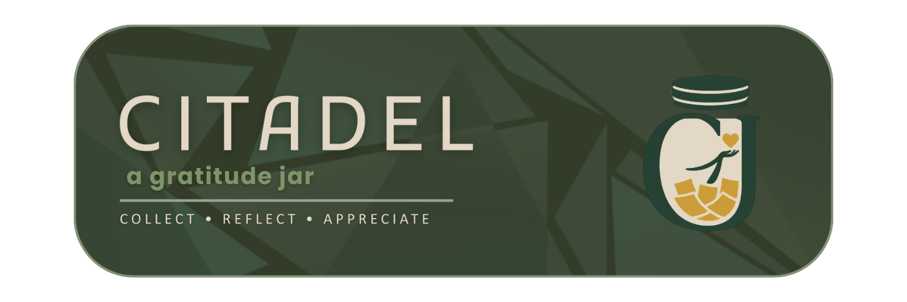

<p align="center">
  
</p>>

<h1 align="center"> CITADEL</h1>

<h3 align="center">
Gratitude Jar Mobile Application Prototype
</h3>


## Project Description and Purpose
CITADEL is a mobile application prototype designed to help users practice gratitude and self-reflection through digital journaling.

It allows users to write different types of entries such as:
- Milestones
- Quotes
- Memories
- General journal entries

The main purpose of CITADEL is to promote emotional well-being by encouraging users to reflect on positive experiences, track their mood over time, and build consistency through journaling streaks.

---

## UML Diagram
> Paste the final UML Diagram image here.

```md

```

---

## Features and Functionalities

### 📖 Journal Entry System
- Add entries (milestone, quote, memory, or general notes)
- Edit existing entries
- Delete unwanted entries

### 🫙 Gratitude Jar Feature
- Tap the jar to “shake” it
- Random entry is displayed for reflection and nostalgia

### 😊 Mood Board
- Displays user’s emotional trends based on past entries
- Visual representation of feelings over time

### 🔥 Streak System
- Tracks consecutive days of journaling
- Encourages consistency and habit-building

### 👤 Profile Panel
- Displays user information

---

## How the Program Works

CITADEL is a mobile journaling application prototype developed using modern mobile application development tools and frameworks.

The application follows a component-based mobile app architecture, where each feature (Journal, Mood Board, Gratitude Jar, and Profile) is treated as a separate screen or module connected through a bottom navigation bar.

### Technical Overview
- The app is built using:
  - *[Insert Framework/Language Here]*  
    Example: Flutter, React Native, Android Studio, etc.

- Data such as journal entries, moods, and streaks are stored using:
  - *[Insert Database/Storage Here]*  
    Example: Firebase, SQLite, Local Storage, etc.

- The UI updates dynamically when users interact with different modules.
- State management is used to handle changes in entries, moods, and user activity in real time.

---

## App Behavior

When the app launches, the user is directed to the login interface where they can either create an account or log in to an existing account.

A bottom navigation bar allows switching between:
- Mood Board and Streak
- Gratitude Jar
- Entries
- Profile

When a user taps an icon, the screen dynamically changes to display the selected section.

The user can then:
- Create, edit, or delete journal entries in the Entries section
- View mood trends in the Mood Board section
- Shake the Gratitude Jar to reveal a random memory
- View and manage profile information in the Profile section

The app continuously updates data such as streaks and mood insights based on user activity.

---

## How to Run the Application

### 1. Clone the Repository
```bash
git clone https://github.com/your-username/citadel-app.git
```

### 2. Open the Project
Open the project using your preferred IDE or code editor.

### 3. Install Dependencies
```bash
npm install
```

### 4. Run the Application
```bash
npm start
```

### 5. Launch on Mobile Emulator or Device
- Android Emulator
- iOS Simulator
- Physical Mobile Device

---

## Developer Team

### 👨‍💻 Fernandez, John Rommel P.
**Project Manager / Lead Developer**  
📧 [Insert email]

---

### 👨‍💻 Julian Carlo C. Magbuhat
**GUI Designer / Developer**  
📧 24-01351@g.batstate-u.edu.ph

---

### 👨‍💻 Apolinar, Jev Austin A.
**Logic Developer / Tester**  
📧 [Insert email]

---
